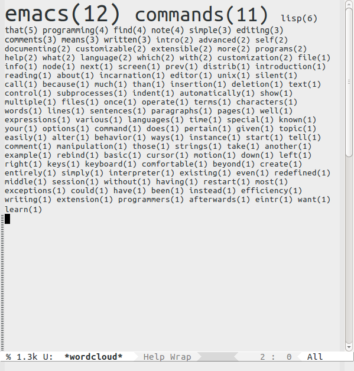

# wordcloud.el

Generate a word cloud.

## Commentary:

`wordcloud.el` generates a simple text word cloud of a buffer's content. For
example, here's a cloud of the words in the "Introduction to Emacs" page in
the Emacs info.

[//]: # (README.md ends here)
